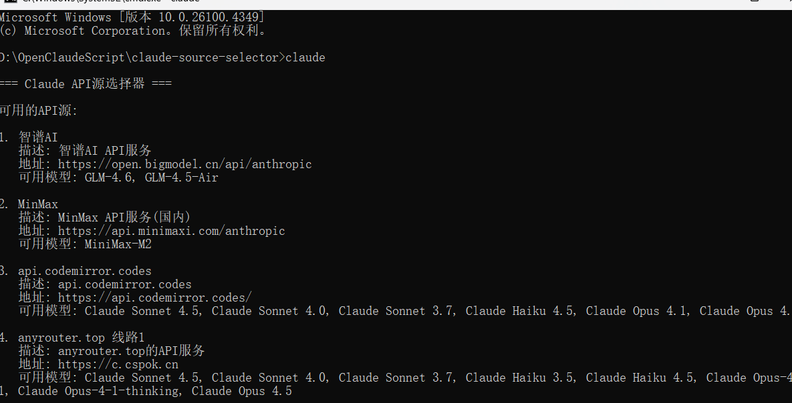

# Claude Source Selector

一个用于 Claude Code 的 API 源选择器，支持在启动时选择不同的 API 源和模型。

## 功能特点

- 启动时交互式选择 API 源
- 支持多模型选择
- 自动配置 Claude Code 的 settings.json
- 支持直接传参跳过选择

## 系统要求

- Windows 操作系统
- Node.js 14.0 或更高版本
- 已安装 Claude Code（通过 npm）

## 安装

### 方式一：自动安装（推荐）

1. 下载本项目到任意目录
2. 双击运行 `install.bat`
3. 按提示完成安装

### 方式二：手动安装

1. 将 `claude-selector.js` 和 `claude.bat` 复制到 `%USERPROFILE%\Scripts\` 目录

2. 将 `claude-sources.example.json` 复制到 `%USERPROFILE%\.claude\claude-sources.json`

3. 确保 `%USERPROFILE%\Scripts` 在系统 PATH 环境变量中，**且排在 `%USERPROFILE%\AppData\Roaming\npm` 前面**。
   
   > **重要**：由于 `@anthropic-ai/claude-code` 也会在 `AppData\Roaming\npm` 目录下创建 `claude` 相关文件，如果该目录排在 `Scripts` 前面，运行 `claude` 时会优先调用官方版本而不是本选择器，导致功能失效或递归报错。请务必调整 PATH 顺序，确保 `Scripts` 在前面。

## 配置

编辑 `%USERPROFILE%\.claude\claude-sources.json` 文件，添加你的 API 源：

```json
{
  "sources": [
    {
      "name": "API源名称",
      "description": "API源描述",
      "env": {
        "ANTHROPIC_AUTH_TOKEN": "your-api-key",
        "ANTHROPIC_BASE_URL": "https://api.example.com",
        "API_TIMEOUT_MS": "300000",
        "DISABLE_AUTOUPDATER": "1"
      },
      "models": [
        {
          "name": "模型显示名称",
          "model_id": "model-id",
          "description": "模型描述"
        }
      ]
    }
  ]
}
```

### 配置说明

| 字段 | 说明 |
|------|------|
| `name` | API 源的显示名称 |
| `description` | API 源的描述信息 |
| `env.ANTHROPIC_AUTH_TOKEN` | API 密钥 |
| `env.ANTHROPIC_BASE_URL` | API 基础 URL |
| `env.API_TIMEOUT_MS` | 请求超时时间（毫秒） |
| `env.DISABLE_AUTOUPDATER` | 禁用自动更新（设为 "1"） |
| `models` | 可选，模型列表 |
| `models[].name` | 模型显示名称 |
| `models[].model_id` | 模型 ID |
| `models[].description` | 模型描述 |

如果不配置 `models`，可以在 `env` 中设置 `ANTHROPIC_DEFAULT_SONNET_MODEL` 指定默认模型。

## 使用方法

### 交互式选择

直接在终端运行：

```bash
claude
```

会显示 API 源选择菜单：

```
=== Claude API源选择器 ===

可用的API源:

1. API源1
   描述: xxx
   地址: https://xxx
   可用模型: Model1, Model2

2. API源2
   ...

0. 退出
请选择要使用的API源 (输入数字):
```

### 跳过选择

如果传入任何参数，将跳过选择直接启动 Claude Code：

```bash
claude --help
claude --version
claude mcp list
```

## 文件说明

```
claude-source-selector/
├── claude.bat                    # 入口脚本
├── claude-selector.js            # 主逻辑脚本
├── claude-sources.example.json   # 配置文件模板
├── install.bat                   # 安装脚本
└── README.md                     # 本说明文档
```

## 常见问题

### Q: 运行 `claude` 提示找不到命令？

A: 确保 `%USERPROFILE%\Scripts` 目录已添加到系统 PATH 环境变量。添加后需要重启终端。

### Q: 运行 `claude` 提示"系统找不到指定的路径"？

A: 这通常是因为 PATH 中存在多个 `claude` 命令，且 `AppData\Roaming\npm` 排在 `Scripts` 前面，导致系统优先找到了官方安装的入口文件。解决方法：

1. **调整 PATH 顺序**：将 `%USERPROFILE%\Scripts` 移到 `%USERPROFILE%\AppData\Roaming\npm` 前面：
   ```bash
   setx PATH "%USERPROFILE%\Scripts;%PATH%"
   ```
   然后重启终端。

2. **或者直接使用完整路径运行**：
   ```bash
   %USERPROFILE%\Scripts\claude.bat
   ```

### Q: 安装 MCP 时报错？

A: 这是因为自定义的 `claude.bat` 覆盖了原版命令。解决方法：

1. 直接使用原版命令安装：
   ```bash
   %USERPROFILE%\AppData\Roaming\npm\claude.cmd mcp add xxx
   ```

2. 或者使用 npx：
   ```bash
   npx @anthropic-ai/claude-code mcp add xxx
   ```

### Q: 如何添加新的 API 源？

A: 编辑 `%USERPROFILE%\.claude\claude-sources.json`，在 `sources` 数组中添加新的配置项。

## 工作原理

1. 脚本读取 `~/.claude/claude-sources.json` 中的 API 源配置
2. 用户选择 API 源和模型后，脚本更新 `~/.claude/settings.json`
3. 启动 Claude Code，它会读取 settings.json 中的环境变量配置

## 使用效果

## 许可证

MIT License
